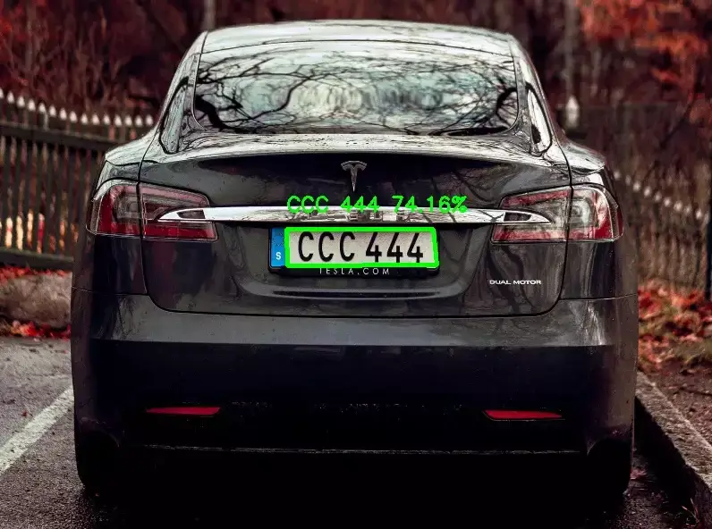

# Vehicle-Plate-OCR

Implementation of an image processing pipeline to extract and recognize text from a number plate using OpenCV and Tesseract OCR. It captures frames from a webcam, allows you to save an image by pressing the spacebar, processes the saved image, detects the number plate, crops it, and finally uses Tesseract OCR to extract the text from the number plate.  🚘📸





## How Program Work

- It initializes the necessary libraries and sets the Tesseract OCR executable path.
  ```Python
  pytesseract.pytesseract.tesseract_cmd = r"C:\Program Files\Tesseract-OCR\tesseract.exe"
  ```
- It captures frames from the webcam using OpenCV's VideoCapture function and displays them in a window.
  ```Python
  cam = cv2.VideoCapture(0)
  ```
- While running, the program waits for key events. If the **SPACE** key is pressed, it saves the current frame as an image file.
- After capturing an image, it reads the saved image using OpenCV's imread function and performs a series of image processing steps:
  - Resizes the image to a specific width using `imutils.resize`.
  - Converts the image to grayscale using `cv2.cvtColor`.
  - Reduces noise in the image using bilateral filtering with `cv2.bilateralFilter`.
  - Detects edges in the image using Canny edge detection with `cv2.Canny`.
  - Finds contours in the image using `cv2.findContours`.
  - It draws the contours on the image using `cv2.drawContours` and displays the image with drawn contours.
- It sorts the contours by area and selects the top contours.
- It loops through the selected contours and checks if any contour has four sides. If it does, it considers it as the number plate contour and performs the following steps:
  - Extracts the bounding rectangle coordinates of the number plate using `cv2.boundingRect`.
  - Crops the image to the bounding rectangle to obtain the number plate region.
  - Saves the cropped image with a sequentially numbered file name.
  - It draws the identified number plate contour on the original image using `cv2.drawContours` and displays the final image with the identified number plate.
- It uses Tesseract OCR (`pytesseract.image_to_string`) to extract text from the cropped number plate image.
- If text is successfully extracted, it prints the current date and time along with the extracted text. Otherwise, it prints **"No text found"**.
- The program waits for a key press to exit.
  

# Packages  📦

- [OpenCV](https://pypi.org/project/opencv-python/) (import cv2): OpenCV is a popular computer vision library that provides various functions and algorithms for image and video processing.

- [imutils](https://pypi.org/project/imutils/) (import imutils): imutils is a convenience library built on top of OpenCV, providing additional image processing functions and utilities.

- [pytesseract](https://pypi.org/project/pytesseract/) (import pytesseract): pytesseract is a Python wrapper for Tesseract OCR, an open-source optical character recognition engine. It allows you to extract text from images.

- [datetime](https://pypi.org/project/DateTime/) (from datetime import datetime): The datetime module is part of Python's standard library and provides classes for manipulating dates and times.


## Install ⬇

`pip install {Package}`

# License

[](https://opensource.org/licenses/Apache-2.0)
